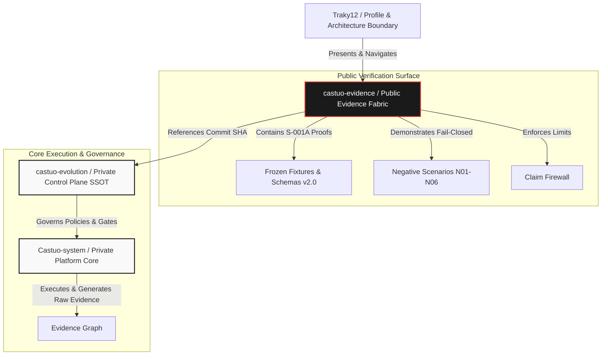

# CASTÚO-SYSTEM™ EvOS v13.0 — Architecture & Presentation Script

## 1. Ecosystem Connectivity Diagram (Mermaid)

---

## 2. Presentation Script: Architecture of `castuo-evidence`

### Introduction: The Technical Transparency Dilemma
"When building critical autonomous systems, architects face a profound dilemma: how do you prove that your engineering claims are real without exposing proprietary codebases, operational data, or internal enterprise integrations? CASTÚO-SYSTEM™ solves this through a layered architecture, where `castuo-evidence` acts as our public Evidence Fabric."

### The Role of `castuo-evidence`
"This is not a traditional software repository; it is a reproducible unit of evidence. Its singular purpose is to answer four foundational questions for any external evaluator:
1. What technical contract defines the capability (e.g., S-001A offline continuity)?
2. What exact evidence object was generated during bounded local execution?
3. How do negative scenarios prove that the system fails safely under stress?
4. How can a third party independently reproduce these checks?"

### The Core Components
- **Frozen Fixtures & Schemas v2.0:** Immutable data structures that anchor reproducibility.
- **Negative Scenarios (N01-N06):** Deterministic tests proving fail-closed behavior under policy unavailability, missing provenance, or hash mismatch.
- **Claim Firewall:** Explicit boundary rules enforcing that missing evidence or broken integrity results strictly in `CLAIM DENY` and `PROMOTION BLOCKED`.

### The Connective Tissue (Private-Public Link)
"The elegance of the architecture lies in the bridge between public trust and private intellectual property:
- The public evidence repository references an immutable **Commit SHA** in the private core.
- The private governance control plane (`castuo-evolution`) exports verified evidence objects into the public fabric.
- Evaluators can clone `castuo-evidence`, run the local test suite, validate schemas, and simulate foreign replays (1R) without ever accessing proprietary business logic."

### Conclusion
"Progress is no longer declared; it is demonstrated. Through this architecture, CASTÚO-SYSTEM™ provides a blueprint for how technical governance and IP protection can coexist in modern systems engineering."
